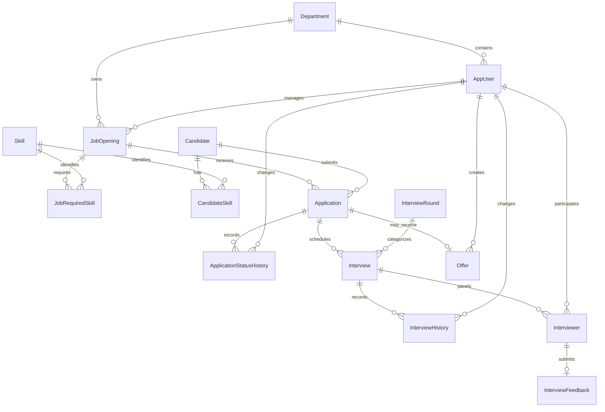

# Entity relationship diagram

```mermaid
erDiagram
  Department ||--o{ AppUser : contains
  Department ||--o{ JobOpening : owns
  AppUser ||--o{ JobOpening : manages
  JobOpening ||--o{ JobRequiredSkill : requires
  Skill ||--o{ JobRequiredSkill : identifies
  Candidate ||--o{ CandidateSkill : has
  Skill ||--o{ CandidateSkill : identifies
  JobOpening ||--o{ Application : receives
  Candidate ||--o{ Application : submits
  Application ||--o{ ApplicationStatusHistory : records
  AppUser ||--o{ ApplicationStatusHistory : changes
  Application ||--o{ Interview : schedules
  InterviewRound ||--o{ Interview : categorizes
  Interview ||--o{ InterviewHistory : records
  AppUser ||--o{ InterviewHistory : changes
  Interview ||--o{ Interviewer : panels
  AppUser ||--o{ Interviewer : participates
  Interviewer ||--o| InterviewFeedback : submits
  Application ||--o| Offer : may_receive
  AppUser ||--o{ Offer : creates
```

`Interviewer` is a composite-key bridge between interviews and users. Feedback references that bridge so only assigned panel members can provide feedback.
